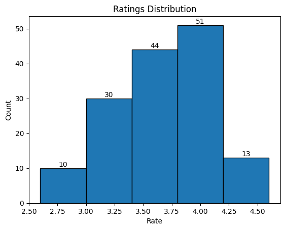

# Zomato Data Analysis Using Python

## Table of Contents
- [Introduction](#introduction)
- [Dataset Overview](#dataset-overview)
- [Project Workflow](#project-workflow)
  - [Data Preprocessing](#data-preprocessing)
  - [Analysis Insights](#analysis-insights)
    1. [Restaurant Types](#1-restaurant-types)
    2. [Maximum Votes](#2-maximum-votes)
    3. [Online Order Distribution](#3-online-order-distribution)
    4. [Ratings Distribution](#4-ratings-distribution)
    5. [Cost Analysis](#5-cost-analysis)
    6. [Online vs Offline Ratings](#6-online-vs-offline-ratings)
- [Visualizations](#visualizations)
- [Conclusion](#conclusion)
- [How to Run](#how-to-run)
- [Technologies Used](#technologies-used)

---

## Introduction
This project provides an exploratory data analysis (EDA) of the Zomato dataset to extract meaningful insights about restaurants. The analysis leverages Python libraries for data manipulation, visualization, and statistical insights.

---

## Dataset Overview
The dataset used contains detailed information about restaurants, including:
- **Type of restaurant** (e.g., dining, cafe)
- **Votes** received by each restaurant
- **Online ordering availability**
- **Ratings** and **Approximate cost for two people**

---

## Project Workflow

### Data Preprocessing
1. Import necessary libraries: `pandas`, `numpy`, `matplotlib`, `seaborn`.
2. Load the dataset into a DataFrame.
3. Clean and preprocess columns like `rate` by converting text into numeric values.
4. Handle missing or inconsistent data.

### Analysis Insights

#### 1. Restaurant Types
- Most restaurants fall into the **dining** category.
- **Votes** indicate dining restaurants are more popular.

#### 2. Maximum Votes
- Identified the restaurant with the **highest number of votes**:
  - `Restaurant Name(s): <Restaurant_Name>`.

#### 3. Online Order Distribution
- Visualized the proportion of restaurants offering **online** vs **offline** orders.
- **Majority of restaurants** do not accept online orders.

#### 4. Ratings Distribution
- Analyzed restaurant ratings to understand customer satisfaction:
  - Most ratings range from **3.5 to 4.0**.

#### 5. Cost Analysis
- Explored the **approximate cost for two people**:
  - Majority prefer restaurants with an **approximate cost of ₹300**.

#### 6. Online vs Offline Ratings
- **Online orders** receive higher ratings compared to **offline orders**.
- Cafes primarily receive online orders, while dining restaurants accept offline orders.

---

## Visualizations
### Key Charts and Graphs
1. **Count Plot** of restaurant types.
2. **Pie Chart** showcasing online vs offline order distribution.
3. **Histogram** of ratings.
4. **Cost Distribution** for two people.
5. **Box Plot** comparing ratings for online and offline orders.
6. **Heatmap** correlating restaurant types with order preferences.

### Sample Visual
  
*Example: Histogram showcasing restaurant ratings.*

---

## Conclusion
This analysis highlights key customer preferences in the restaurant industry:
- Dining restaurants dominate the market and receive higher votes.
- Online orders are more prevalent in cafes and yield higher ratings.
- Cost sensitivity exists, with ₹300 being a preferred range for two people.

These insights provide actionable recommendations for restaurant owners and aggregators to enhance customer satisfaction and engagement.

---

## How to Run
1. Clone this repository:
   ```bash
   git clone <repository_url>
